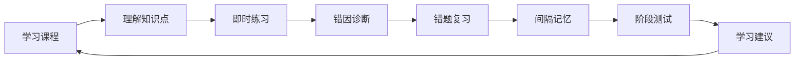

# 信息架构

## 核心原则

一造学伴不是题库功能集合，而是一条由学习状态驱动的路径：



所有一级入口都服务于闭环中的一个阶段；高级能力不直接堆在导航中。

## 全局导航

### 手机端

底部导航固定为五项：

1. **首页**：今天最需要完成的事项。
2. **学习**：科目、章节、课程和知识点。
3. **刷题**：章节练习、专项、真题和阶段测试。
4. **复习**：今日卡片、错题本和记忆计划。
5. **我的**：学习报告、记录、笔记收藏与个人设置。

搜索、消息、版本切换不占底部导航；只在相关页面头部或二级页面出现。

### 电脑端

左侧主导航使用相同五个业务域，增加文本标签和当前科目上下文。顶部只保留全局搜索、考试倒计时、帮助和账户。桌面端可以并列展示目录、主任务和辅助信息，但主任务区始终拥有最大的视觉权重。

## 内容层级

```text
考试目标
├── 教材/考试版本
├── 科目
│   ├── 章节
│   │   ├── 小节
│   │   │   ├── 课程/课时版本
│   │   │   ├── 知识点版本
│   │   │   └── 章节练习
│   │   └── 章节测试
│   └── 科目阶段测试
├── 真题与模拟考试
└── 用户学习资产
    ├── 作答与错因
    ├── 错题与收藏
    ├── 笔记
    ├── 复习卡与计划
    └── 报告与建议
```

课程、知识点、题目和背诵卡均引用明确版本。切换教材版本时，系统保留用户历史记录并说明内容映射情况。

## 页面与唯一主要任务

| 页面 | 主要任务 | 默认展示 | 按需展开 |
| --- | --- | --- | --- |
| 首页 | 开始今天最重要的学习 | 1 个主任务、最多 2 个次任务 | 本周计划、完整数据 |
| 科目章节 | 找到下一章节 | 章节状态、题量、已做、错题 | 小节、知识点、全部统计 |
| 课程学习 | 理解当前内容块 | 正文与当前学习进度 | 目录、笔记、关联题 |
| 刷题 | 完成当前题目 | 题干、选项、必要工具 | 题卡、设置、草稿历史 |
| 答题解析 | 理解为何错及下一步 | 结果、关键解析、错因选择 | 完整推导、讨论、来源 |
| 今日复习 | 完成到期复习 | 一张卡、回忆操作 | 队列与调度说明 |
| 错题本 | 选择一组值得重练的题 | 推荐分组与最近错误 | 多维筛选、批量管理 |
| 学习报告 | 接受下一阶段建议 | 一条主建议及证据 | 趋势、章节明细、导出 |

## 两次点击规则

从首页出发，以下动作必须在两次点击以内进入任务：

- 继续上次课程：主页主卡 → 课程。
- 开始今日复习：主页复习卡 → 第一张卡。
- 开始推荐练习：主页练习卡 → 第一题。
- 查看错题：复习 → 错题本。
- 查看学习建议：我的 → 学习报告。

版本切换、组卷高级条件、批量错题管理允许超过两次点击，因为它们不是高频即时任务。

## 渐进式披露

- 章节页先显示章级摘要，点击后才加载小节和知识点。
- 刷题首页先给推荐练习，高级组卷放入“自定义训练”。
- 解析页先展示关键结论和错因，完整计算步骤默认折叠。
- 报告先展示建议与可信证据，详细指标和导出默认收起。
- 手机端过滤器使用底部抽屉；桌面端使用侧栏，但默认条件数量一致。

## 状态模型

章节和任务采用可理解的状态，而不是只给百分比：

- 未开始
- 学习中
- 待巩固
- 待复习
- 已掌握
- 版本已更新

“已掌握”必须同时考虑知识学习、练习正确性和间隔复习表现，不能由观看完成或一次答对直接触发。
