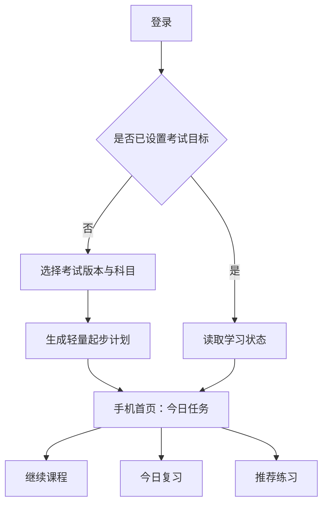
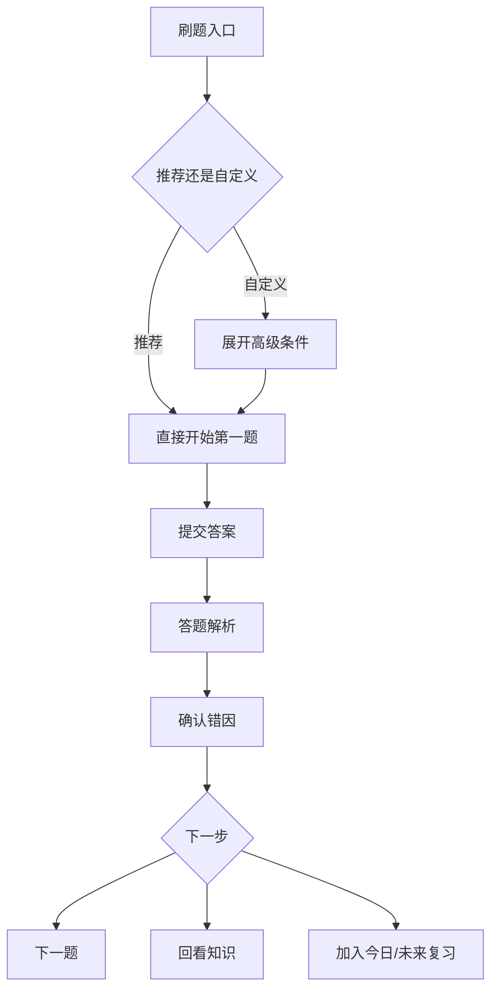
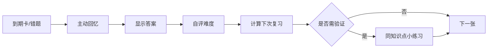
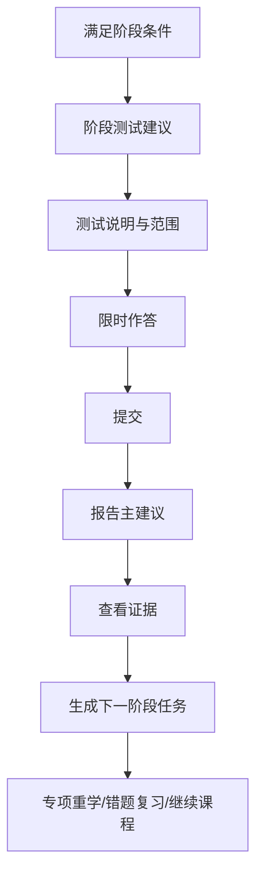

# 页面流程

## 首次进入与日常返回

目标选择只在首次使用或主动修改时出现，不让每次进入都先穿过选择页。

## 课程理解与即时练习

### 手机页面

- **科目章节页**：顶部切换科目和版本；章级行展示状态、题量、已做、错题；默认只展开当前章。
- **课程学习页**：单列内容；底部显示“继续”主动作；目录、笔记和块类型说明放入抽屉。
- **答题解析页**：首屏给结果、关键结论和错因选择；完整推导与来源折叠。

### 电脑页面

- **课程学习页**：左侧目录、中间内容块、右侧本节目标与笔记。滚动位置和移动端共享。

## 刷题与错因诊断

### 刷题页约束

- 普通练习不突出计时；限时训练才固定显示剩余时间。
- 题卡默认收起，桌面端可常驻左栏。
- 提交是唯一主动作；收藏、笔记和反馈降为次要操作。
- 案例题未来按 `QuestionPart` 独立保存并显示分值、评分点和步骤。

## 复习闭环

- **今日复习页**一次只呈现一张卡，队列信息弱化。
- **错题本**默认按“最值得重练”排序，而非最近或题目数量。
- 重练答对不会立即删除错题；经过间隔验证后转为已掌握。

## 阶段测试与报告

报告信息顺序固定为：

1. 下一阶段的一条主建议。
2. 支撑建议的 2–3 条证据。
3. 可以立即开始的任务。
4. 趋势、章节明细、错因分布等高级数据。

## 原型页面清单

### 手机端

1. 首页：确认“今天先做什么”。
2. 科目章节页：定位下一章节。
3. 课程学习页：理解当前知识块。
4. 刷题页：完成当前题目。
5. 答题解析页：确认错因和改进动作。
6. 今日复习页：完成到期记忆。
7. 错题本：选择值得重练的错题组。
8. 学习报告：接受下一阶段建议。

### 电脑端

1. 首页：在更宽视野中安排今日节奏。
2. 课程学习页：目录、内容、笔记协同。
3. 刷题页：题卡、作答和辅助工具协同。
4. 学习报告：建议与证据同屏复盘。

## 设计审核问题

- 手机首页是否能在不滚动时明确唯一优先任务？
- 课程和练习之间的往返是否自然？
- 错因选择是否比单纯显示答案更有价值？
- 报告是否先给行动而不是图表？
- 电脑端增加的信息是否真正支持深度任务？
- 是否有任何页面因“功能全面”而失去主要任务？
